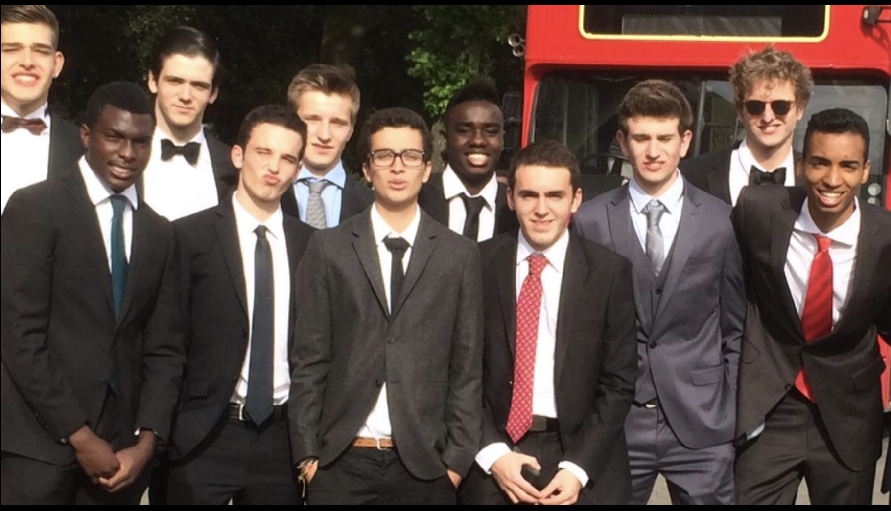

# 🎉 ZbrePlanning - La Team au Complet

Plateforme de planning pour la Zbre Team pour organiser des activités et regarder la Coupe du Monde 2026 ensemble.



## ✨ Fonctionnalités

### 🏠 Page d'accueil
- Photo de groupe en hero avec animations
- Stats dynamiques (membres, matchs, jours avant la CDM)
- Accès rapide à toutes les sections
- Vue de tous les membres de la team

### ⚽ Coupe du Monde 2026
- Calendrier complet des **104 matchs**
- Filtres par phase (Groupes, 8e, Quarts, Demis, Finale)
- Filtres par groupe (A à L)
- Drapeaux des équipes
- Système de participation: **Oui / Peut-être / Non**
- Proposition de lieux pour regarder les matchs ensemble
- Vote pour les lieux préférés
- Affichage des participants avec photos

### 📅 Activités
- **8 types d'activités**: Restaurant, Bar, Sport, Cinéma, Gaming, Soirée, Voyage, Autre
- Création d'activités en 2 étapes (type puis détails)
- Participation avec photos des membres
- Affichage clair de qui vient / peut-être / ne vient pas

### 🗓️ Calendrier
- Vue calendrier mensuel interactive
- Visualisation des matchs et activités par date
- Navigation rapide vers les mois de la CDM
- Détails au clic sur une date
- Légende des couleurs

## 🚀 Installation

```bash
# Se placer dans le dossier
cd ~/Desktop/zbreplanning

# Installer les dépendances
npm install

# Lancer en développement
npm run dev
```

L'app sera disponible sur **http://localhost:3000** (ou 3002 si 3000 est occupé).

## 👥 Membres de la Team

1. Benjamin Oyowe
2. Edu Rodger Martinez
3. Gregory Longueville
4. Ian Poznanski
5. Kevin Nounomo
6. Killian Bohan
7. Lionel Holzapfel
8. Martin Bracken
9. Maximilien Piquet
10. Nicolas Reuter
11. Ramzi Lahouegue
12. Ruairi Doyle
13. Sacha Convens
14. Sam Spinnael

## ⚽ Coupe du Monde 2026

- **Dates**: 11 juin - 19 juillet 2026
- **Pays hôtes**: USA 🇺🇸, Mexique 🇲🇽, Canada 🇨🇦
- **Équipes**: 48
- **Matchs**: 104

## 🎨 Design

- **Theme**: Dark mode avec glassmorphism
- **Couleurs principales**:
  - Primary: `#6366f1` (Indigo)
  - Accent: `#fbbf24` (Gold - pour la CDM)
  - Success: `#22c55e` (Vert - pour "Je viens")
  - Warning: `#f59e0b` (Orange - pour "Peut-être")
  - Danger: `#ef4444` (Rouge - pour "Non")

## 💾 Mode Démo

L'app fonctionne en **mode démo** avec localStorage. Les données sont stockées localement dans le navigateur de chaque utilisateur.

Pour une utilisation en production avec synchronisation entre utilisateurs, il faut configurer Supabase.

## ☁️ Configuration Supabase (optionnel)

1. Créer un projet sur [supabase.com](https://supabase.com)

2. Créer le fichier `.env.local`:
```env
NEXT_PUBLIC_SUPABASE_URL=https://votre-projet.supabase.co
NEXT_PUBLIC_SUPABASE_ANON_KEY=votre-anon-key
```

3. Exécuter le schéma SQL dans l'éditeur Supabase (voir `supabase-schema.sql`)

4. Décommenter les lignes dans `middleware.ts` pour activer l'auth

## 🌐 Déploiement

### Vercel (recommandé)
```bash
npm i -g vercel
vercel
```

### Autres options
- Netlify
- Railway
- DigitalOcean App Platform

## 🛠️ Tech Stack

- **Framework**: Next.js 15 (App Router)
- **Styling**: Tailwind CSS
- **Database**: Supabase (PostgreSQL) ou localStorage en mode démo
- **Auth**: Supabase Auth (optionnel)
- **Icons**: Emojis natifs

## 📁 Structure

```
src/
├── app/
│   ├── page.tsx          # Page d'accueil
│   ├── login/            # Connexion (choix du membre)
│   ├── world-cup/        # Coupe du Monde 2026
│   ├── activities/       # Activités de la team
│   └── calendar/         # Calendrier des événements
├── components/
│   └── Navbar.tsx        # Navigation
├── data/
│   ├── members.ts        # Liste des 14 membres
│   └── matches.json      # 104 matchs de la CDM
└── lib/
    ├── demo-store.ts     # Stockage localStorage
    └── supabase/         # Client Supabase
```

---

Made with ❤️ pour la Zbre Team • Bruxelles 🇧🇪
